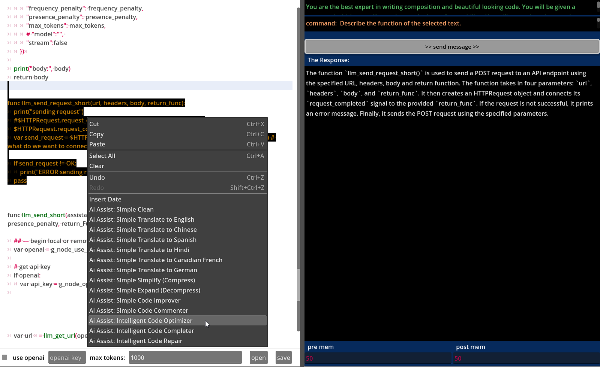

# Welcome to The NoteBloke LLM Text Editor

Hey there, fellow text enthusiast! Are you tired of boring, uninspired text editors that make you want to take a nap instead of writing? Well, fear not! Because you've stumbled upon **The NoteBloke LLM Text Editor** - where creativity meets productivity in the most delightful way possible!

## What's the Buzz?

Imagine having a trusty sidekick, your very own AI assistant, ready to lend a helping hand whenever you're stuck with your writing. That's right! Our text editor comes packed with LLM (Large Language Model) agents that are just itching to assist you. From translating snippets of text into exotic languages to cleaning up your messy code and even conjuring up magical summaries or expansions, our agents have got your back!

## Features That Make You Go "Wow!"

- **AI-Powered Awesomeness**: Our LLM agents are like wizards with words, making your writing experience smoother than a freshly buttered slide!
- **Customizable Assistant**: Tired of boring prompts and generic suggestions? Customize your AI assistant to suit your quirky writing style. Go ahead, make it crack jokes or shower you with compliments. The choice is yours!
- **Context Menus for Days**: Need a quick fix or a nifty shortcut? Our context menus are your best friend. With just a right-click, you can unleash a world of text manipulation and code completion at your fingertips!

## How to Get Started?

1. **Download and Install**: Get your hands on the latest version of "The NoteBloke LLM Text Editor" and run the "project.godot" file in Godot 4 or better. Then click the play button or press "f5". Trust us, it's like unwrapping a present on your birthday!
3. ** Activate the Backend **: Load up your backend api server (like LMStudio) or put in your api key for openai (if using openai, make sure to check the box if you want to use them; be aware of service fees).
3. **Explore and Experiment**: Dive headfirst into the world of AI-assisted writing. Test out different features, play around with customization options, and let your creativity run wild!
4. **Spread the Word**: Once you've experienced the magic of NoteBloke, don't keep it to yourself! Share the love with your friends, colleagues, distant relatives, and that guy you met at the coffee shop who keeps talking about his pet iguana.

## Contribute and Collaborate

We're not just building a text editor; we're creating a community of passionate writers and tech enthusiasts who believe that writing should be fun, not a chore. So, if you have ideas, suggestions, or just want to chat about the wonders of the written word, come join us! Together, we'll turn the world of text editing upside down (in the best possible way).

## Support and Feedback

Got questions? Encountered a bug? Or maybe you just want to shower us with praise? Whatever it is, we're here for you! Reach out to our friendly support team, and we'll do everything in our power to make your NoteBloke experience as delightful as humanly (or should we say, AI-ly) possible.

So what are you waiting for? Dive into the wonderful world of The NoteBloke LLM Text Editor and unleash your inner wordsmith!

Happy writing!

